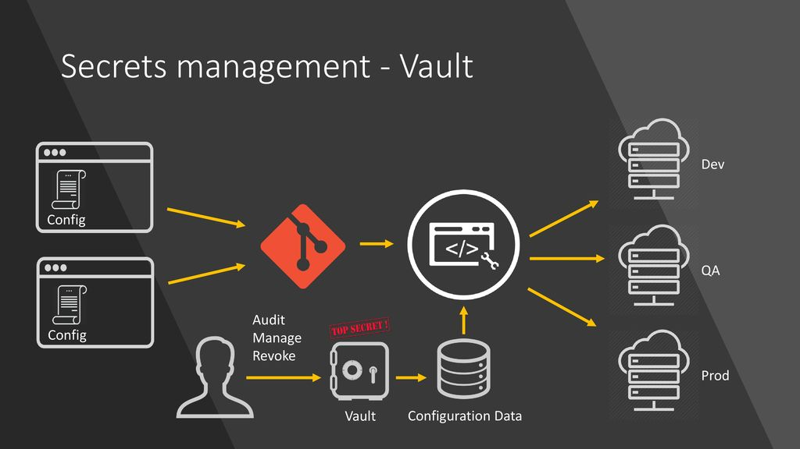

# Заметки о работе с Vault


Кратко:
- Основной плюс, это отзыв secrets
- ACL не привычный, но относительно понятный
- all DENY policy - примерно как и в mikrotik, запрещено все, что не разрешено явно

## Концепции Vault
### Sealing (Запечатывание)/Unsealing (Распечатывание) Vault

Информация, которую вы храните в Vault, защищается мастер-ключом. Vault использует его, чтобы кодировать/декодировать секреты. Мастер-ключ сам по себе недоступен и реконструируется каждый раз, когда вы запускаете/перезапускаете Vault.
Чтобы всё работало надёжно, Vault использует алгоритм Shamir’s Secret Sharing (Схема разделения секрета Шамира).

> Мастер-ключ по-умолчанию разделяется на 5 ключей — это называется **number of shares** (число сторон).

>Для реконструкции мастер-ключа вам понадобится предоставить любые 3 из 5 ключей — это называется **threshold** (порог)

### Root токен


> используется только для конфигурации самого Vault
> Больше - нигде его использовать не рекомендуется!


### Первоначальная инициализация хранилища

```
root@vault:~# vault status
Key                Value
---                -----
Seal Type          shamir
Initialized        false
Sealed             true
Total Shares       0
Threshold          0
Unseal Progress    0/0
Unseal Nonce       n/a
Version            1.9.2
Storage Type       file
HA Enabled         false

```
> Sealed : true 
Это означает, что хранилище запечатано. Для его открытия, нужно призывать хранителей ключей (по дефолту, их 5, но достаточно призвать троих)

На практике - инициализация и выдача ключей, а так же распечатывание выглядит примерно так:
```
root@vault:~# vault operator init
Unseal Key 1: U6cUgPn2NbUfoRr4G0TPWI91FIlxSAHs8m7R8/SMtbha
Unseal Key 2: xHTXjC/SuldYWoSweSKs80YIVeLtddweJ9lL6XPNUeM3
Unseal Key 3: uXISe6DMGdjoSuAOtBLAjkw3G92KIdgdnXfJUMSpLQxu
Unseal Key 4: ybtwK5+rluhiGDiNqxx0WkoaNgnkaGsNgn5QzS9kQDa/
Unseal Key 5: N1jZu8AZbpepsxPfsjiP+tJQDhIBbTOgVbjMoBRVk7XE

Initial Root Token: s.Wt7VBGiG9dFKSC5mNNdwg8nm <- Его лучше не давать и не использовать нигде, ибо от СБ бо-бо
```

И собственно распечатывание хранилища
```
root@vault:~# vault operator unseal U6cUgPn2NbUfoRr4G0TPWI91FIlxSAHs8m7R8/SMtbha
Key                Value
---                -----
Sealed             true
Unseal Progress    1/3

root@vault:~# vault operator unseal xHTXjC/SuldYWoSweSKs80YIVeLtddweJ9lL6XPNUeM3
Key                Value
---                -----
Sealed             true
Unseal Progress    2/3

root@vault:~# vault operator unseal uXISe6DMGdjoSuAOtBLAjkw3G92KIdgdnXfJUMSpLQxu
Key             Value
---             -----
Sealed          false
```


> Теперь необходимо залогиниться в систему командой:

```
vault login
вбить root-токен
```
### Policies (Политики)

Политики в Vault работают как chown/users в Unix — у вас есть пользователь root с доступом ко всему и отдельные пользователи с доступом только к определённому пути.

```
# djangoapp.hcl
path "secret/djangoapp/*" {
  policy = "read"
}
```
> "create" - создать ключ
> 
> "read" - чтение содержимого
> 
> "update" - обновление \ запись
> 
> "delete" - удалить
> 
> "list" - получить список, но не содержимое
> 

### CLI команды
Список секретов
  ```
# vault kv list secret
Keys
----
application/
gi-back-office-streaming/
gi-bonus/
gi-casino-dictao-denmark-report/
gi-casino-dictao-spain-report/
gi-casino-punter-favorites/
gi-dictao-session/
gi-evolution/
```
Получить секрет и список юрисдикций (tab-complete работает при получении list)
```
# vault kv list secret/gi-
secret/gi-back-office-streaming/         secret/gi-provider-betgamestv/
secret/gi-bonus/                         secret/gi-provider-ezugi/
secret/gi-casino-dictao-denmark-report/  secret/gi-provider-microgaming/
secret/gi-casino-dictao-spain-report/    secret/gi-provider-playngo/
secret/gi-casino-punter-favorites/       secret/gi-provider-pragmaticplay/
```
Зоны \ Площадки
```
# vault kv list secret/gi-bonus/
Keys
----
local       <--
m-ald2      <--
m-cur2      <-- У нас это будут юрисдикции\площадки
m-es1       <-- knk, mhd, ams и т.д.
m-it1       <--
```
Содержимое секретов
```
# vault kv get secret/gi-bonus/local/
========== Data ==========
Key                  Value
---                  -----
POSTGRES_PASSWORD    gi_bonus
POSTGRES_USERNAME    gi_bonus
```

#### То же самое, но curl'ом
Чтобы не засорять все ВМ установкой vault, проще проверять curl'ом - хоть наличие ключей, хоть его содержимого.

Список площадок для gi-bonus
```
» curl -H "X-Vault-Token:ТОКЕН_ПАНБЕТ" -X LIST http://vault-testers.mhd.local:8200/v1/secret/gi-bonus/ | jq

{
  "request_id": "9c812d7e-49e0-f75c-da32-6705525aac00",
  "lease_id": "",
  "renewable": false,
  "lease_duration": 0,
  "data": {
    "keys": [
      "local",
      "m-ald2",
      "m-cur2",
      "m-es1",
      "m-it1"
    ]
  },
  "wrap_info": null,
  "warnings": null,
  "auth": null
}
```

Содержимое секретов
```
curl --header "X-Vault-Token:ТОКЕН_ПАНБЕТ" --request GET http://vault-testers.mhd.local:8200/v1/secret/gi-bonus/m-ald2 | jq

{
  "request_id": "8dacf79e-90d4-3839-172e-1f20dbac2b90",
  "lease_id": "",
  "renewable": false,
  "lease_duration": 2764800,
  "data": {
    "POSTGRES_PASSWORD": "m_ald2_gi_bonus",
    "POSTGRES_USERNAME": "m_ald2_gi_bonus"
  },
  "wrap_info": null,
  "warnings": null,
  "auth": null
}

```